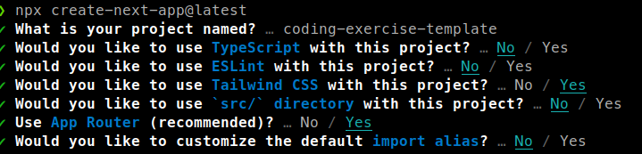

# Coding Exercise using ReScript and NextJs 13

## Installation

### NextJs 13

```bash
npx create-next-app@latest
```



### ReScript

```bash
npm i -D rescript @rescript/react
```

## Setup ReScript

- Make src directory
- Add bsconfig
- Add BlueButton.res in src directory as an example
- Add Main.res in app directory
- Modify page.js to use Main.res component

```js
import { make as C } from './Main'
export default C
```
